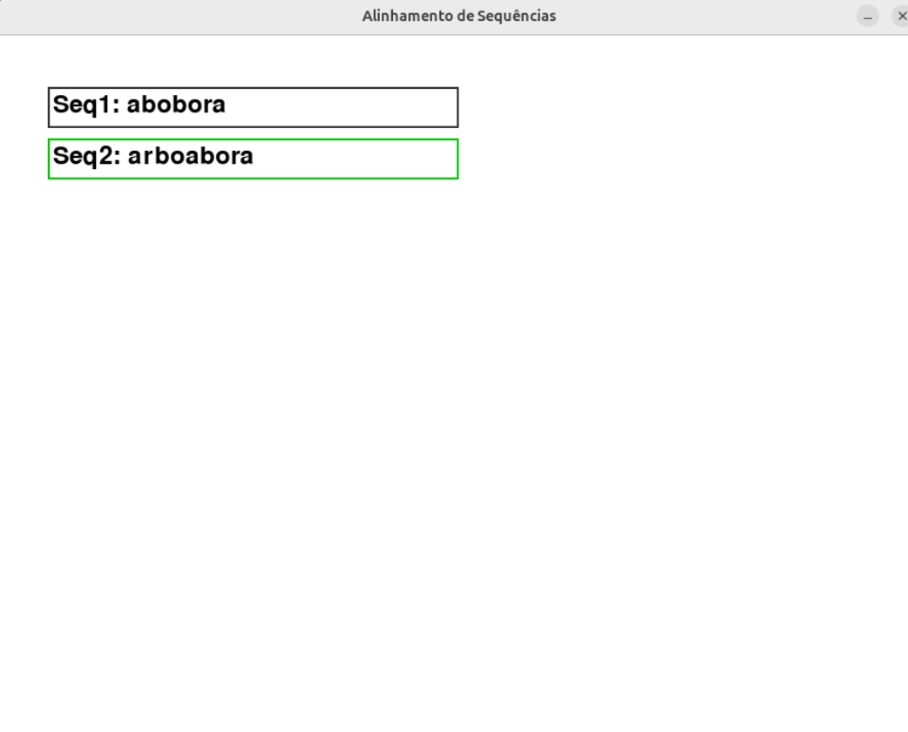
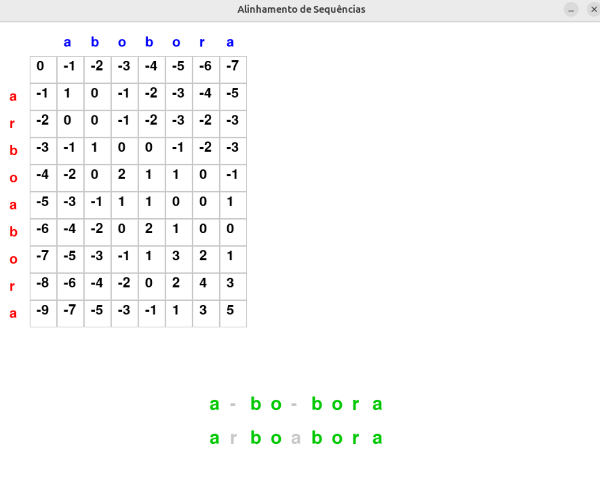

# Projeto Alinhamento de Sequência - Programação Dinâmica

*Número da Lista*: 68<br>
*Conteúdo da Disciplina*: Programação Dinâmica<br>

## Alunos
| Matrícula | Aluno |
| -- | -- |
| 211063200 | Luis Eduardo Carneiro Miranda |
| 211063265 | Vinicius Mendes Martins |


## Sobre  
Este projeto é um alinhador de sequência gráfico e interativo que, através do input do usuário, realiza a iteração do algoritmo e mostra ao final o resultado do alinhamento de sequências.

### Funcionalidades:  
- Interface gráfica interativa para entrada e visualização do alinhamento.
- Execução passo a passo do algoritmo de alinhamento de sequências.
- Representação visual clara dos resultados.
- Opção de entrada personalizada de sequências pelo usuário.

### Implementação do Algoritmo de Alinhamento
O aplicativo utiliza um algoritmo guloso para 

Benefícios da abordagem gulosa:
- Melhor desempenho em comparação com abordagens exaustivas.
- Simplicidade na implementação e entendimento.
- Eficiência na busca por soluções subótimas que são adequadas para muitos casos práticos.
- Redução da complexidade computacional, tornando-o viável para alinhamento de sequências maiores.

## Screenshots
Aqui estão algumas imagens que mostram o algoritmo em funcionamento:





## Instalação  

1. Clone este repositório:  
   ```sh
   git clone https://github.com/projeto-de-algoritmos-2024/PD_Alinhamento
   cd nome-do-projeto
   ```  
2. Instale as dependências do projeto:  
   ```sh
   pip install -r src/requirements.txt
   ```  
3. Execute o aplicativo:  
   ```sh
   python3 src/alinhamento_sequencia.v3.py
   ```   

## Uso
1) Execute o aplicativo seguindo os passos da instalação.
2) Insira as sequências que deseja alinhar na interface.
3) Inicie a execução do algoritmo e acompanhe a visualização interativa do alinhamento.
4) Analise o resultado final e utilize as opções para refazer o alinhamento, se necessário.

## Apresentação 

A apresentação da entrega está presentes nos hiperlink a seguir:

[
